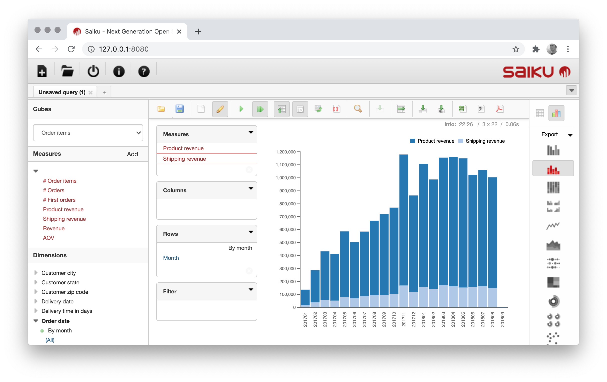
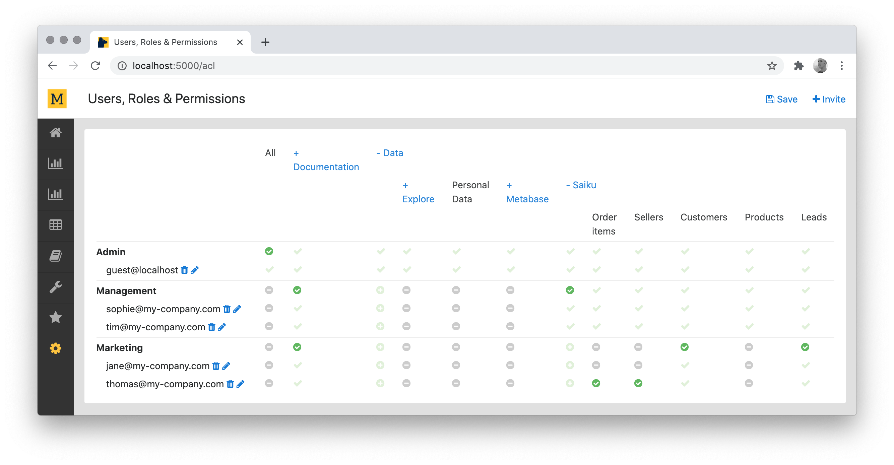

# Mara Mondrian

[](https://travis-ci.org/mara/mara-mondrian)
[](https://github.com/mara/mara-mondrian/blob/master/LICENSE)
[](https://badge.fury.io/py/mara-mondrian)
[](https://communityinviter.com/apps/mara-users/public-invite)

A python interface for [Mondrian Server](https://github.com/project-a/mondrian-server), a [Mondrian](https://en.wikipedia.org/wiki/Mondrian_OLAP_server) [XMLA](https://en.wikipedia.org/wiki/XML_for_Analysis) server combined with the [Saiku](https://www.meteorite.bi/products/saiku/) ad hoc analysis tool. Comes with

- A Makefile for running Mondrian Server locally.

- [Mondrian schema](https://mondrian.pentaho.com/documentation/schema.php) generation from a [Mara Schema](https://github.com/mara/mara-schema) definition.

- Mondrian cache flushing.

- Saiku authentication via [Mara ACL](https://github.com/mara/mara-acl). 


&nbsp;

## Installation

To use the library directly, use pip:

```
pip install mara-mondrian
```

or
 
```
pip install git+https://github.com/mara/mara-mondrian.git
```

For an example of an integration into a flask application, have a look at the [mara example project 1](https://github.com/mara/mara-example-project-1).

&nbsp;

## Running Saiku

From within a project, include [.scripts/mondrian-server.mk](https://github.com/mara/mara-mondrian/tree/master/.scripts/mondrian-server.mk) in your project Makefile (as for example in [https://github.com/mara/mara-example-project-1/blob/master/Makefile](https://github.com/mara/mara-example-project-1/blob/master/Makefile)).

Running `make setup-mondrian-server` will create the required `mondrian-server.properties` file. And then running `make run-mondrian-server` will start Saiku and the XMLA server on port 8080: 



For running Mondrian Server in production, please have a look at [https://github.com/project-a/mondrian-server/blob/master/README.md](https://github.com/project-a/mondrian-server/blob/master/README.md).

&nbsp;

## Features

### Mondrian schema generation

If you have a data warehouse schema defined in [Mara Schema](https://github.com/mara/mara-schema), then you can automatically create a Mondrian schema file using the function `write_mondrian_schema` in [mara_mondrian/schema_generation.py](mara_mondrian/schema_generation.py).

Have a look at [https://github.com/mara/mara-example-project-1/blob/master/app/pipelines/update_frontends/\_\_init\_\_.py](https://github.com/mara/mara-example-project-1/blob/master/app/pipelines/update_frontends/__init__.py) for an example.

&nbsp;

### Mondrian cache flushing

The function `flush_mondrian_cache` in [mara_mondrian/connection.py](https://github.com/mara/mara-mondrian/tree/master/mara_mondrian/connection.py) triggers a reload of the schema and a flushing of all caches in Mondrian Server.

This file also contains functions for making XMLA requests. 

&nbsp;

### Saiku authentication via [Mara ACL](https://github.com/mara/mara-acl)

Once you add the Saiku ACL resource in [mara_mondrian/views.py](https://github.com/mara/mara-mondrian/tree/master/mara_mondrian/views.py) to your project, you can easily control which users can query which cubes:



In this example, users from the "Management" group can query all cubes, and users from "Marketing" only "Customers" and "Leads" (with the exception of Thomas who can also query "Order items" and "Sellers").

Please have a look at [https://github.com/project-a/mondrian-server/blob/master/README.md](https://github.com/project-a/mondrian-server/blob/master/README.md) for how to set this up.

Please make sure that the `/mondrian/saiku/authorize` endpoint is white-listed from the Mara ACL, as for example in [https://github.com/mara/mara-example-project-1/blob/master/app/ui/\_\_init\_\_.py](https://github.com/mara/mara-example-project-1/blob/master/app/ui/__init__.py):

```python
monkey_patch.patch(mara_acl.config.whitelisted_uris)(lambda: ['/mara-app/navigation-bar', '/mondrian/saiku/authorize'])
```

&nbsp;

The easiest way to try out Mara Mondrian is to run the [mara example project 1](https://github.com/mara/mara-example-project-1).